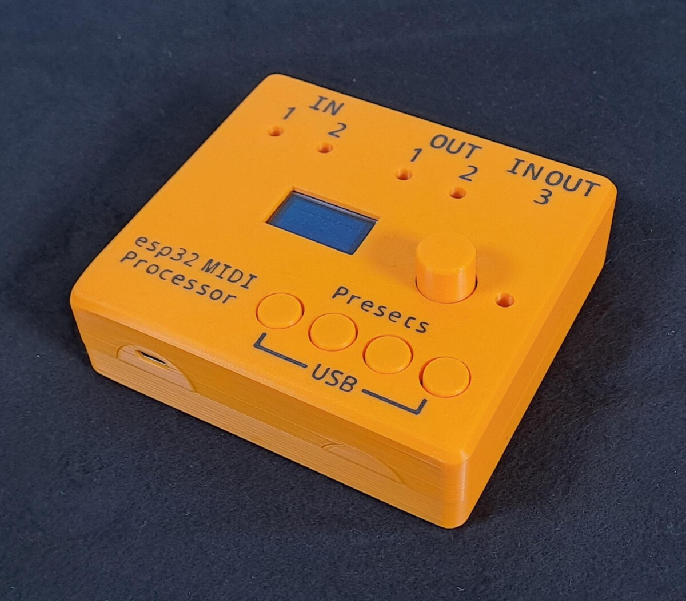

# esp32-midi-processor

esp32-based multitool. Routing, merging, realtime-manipulation of MIDI-data.  
This repo contains code, kicad-files and a BOM for (nearly) one-click order at [pcbway](https://https://pcbway-com).  

Find more details on the project, instructions on how to order your own pcbs and more at https://andyland.info/wordpress/esp32-midi-processor/