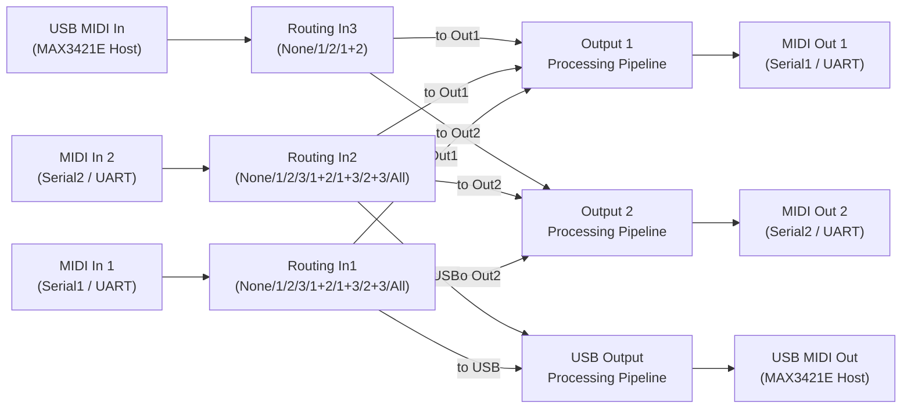
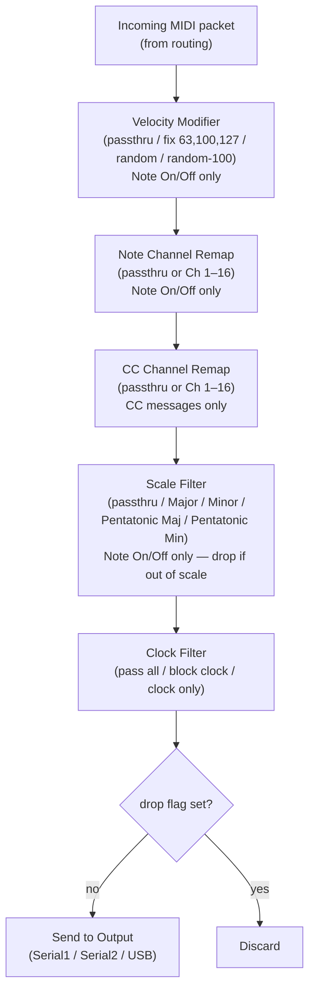
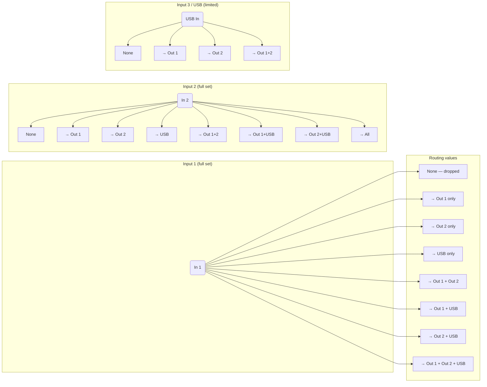
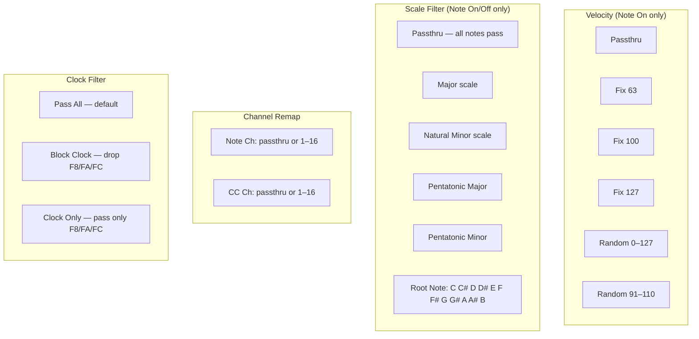
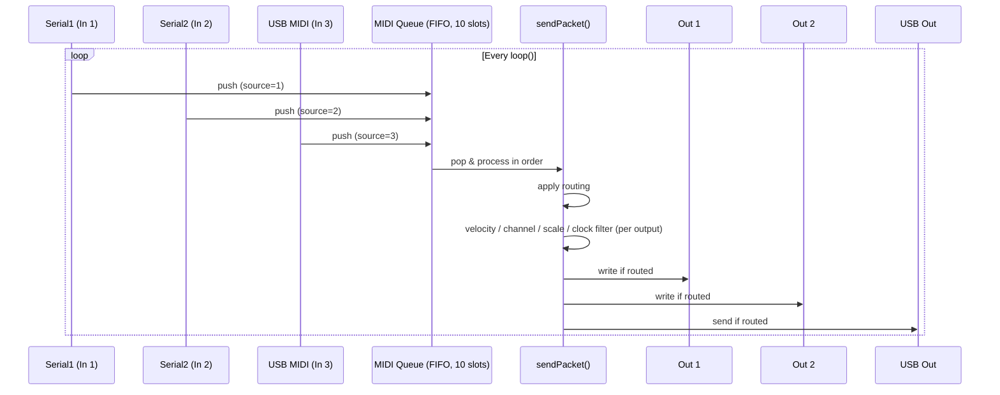

# ESP32 MIDI Processor — Signal Flow Diagrams

## 1. Top-Level Signal Flow

> **Note:** USB In (In3) cannot be routed back to USB Out — only to Out1, Out2, or both.

---

## 2. Per-Output Processing Pipeline

Each of the three outputs has an independent processing pipeline applied to every MIDI message routed to it.

---

## 3. Routing Options Matrix

Each input has an independent routing setting. The table below lists all values.

---

## 4. Per-Output Modifier Details

---

## 5. MIDI Queue / Processing Order

